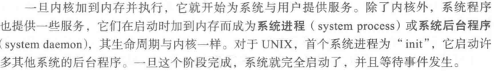

# 第1章：导论

## 1.1 操作系统的功能
- 操作系统控制硬件，并协调各个用户应用程序的硬件使用
- 当计算机系统运行时，操作系统提供正确手段以便使用这些资源
  
从系统视角看，操作系统可以看作资源分配器（resource allocator）。另外，操作系统可以视作一个控制程序，管理用户程序的执行，以防止计算资源的错误或不当使用。

定义：OS是一直运行在计算机上的程序——称为内核（kernel）。除了内核外，还有其他两类程序：系统程序和应用程序。前者是与系统有关的程序，但不是内核的一部分；后者是与系统运行无关的所有其他程序

## 1.2 计算机系统的组成

### 1.2.1 计算机系统的运行
按下电源，cpu运行初始程序（引导程序）。该程序位于计算机固件（firmware）或只读内存中。它初始化系统的各个组件，并且知道如何加载操作系统并且开始执行系统。为了完成这一目标，引导程序必须能够定位操作系统内核并加载到内存中。

事件发生通常通过硬件或软件的中断来通知。硬件中断通过总线发送信号到CPU触发中断。软件通过系统调用（system call）触发中断。

中断机制：触发中断后，中断将控制转移给合适的中断处理程序。处理这一转移的直接方法是：调用一个通用程序来检查中段信息。接着该程序会调用特定的中断处理程序。不过，中断处理应当快捷。由于只有少量预先定义的中断，所以可以通过中断处理程序的指针表来提高速度。这样通过指针表可以间接调用中断处理程序，而无需通过其他中介程序。
### 1.2.2 存储结构
所有形式的内存都提供字节数组，每个子节都有地址。交互通过针对特定内存地址，执行一系列load或store指令实现：
指令load将内存字节保存到CPU寄存器；
指令store将寄存器内容保存到内存中。

- 理想情况下，内存中的数据应该是永久的。然而不可能做到，原因有两点：1.内存的空间通常太小；2.内存是是易失性的，断电之后数据便会丢失
- 完整的存储系统应当只使用必须的昂贵存储，而提高尽可能便宜的、非易失的存储。当两个存储组件的访问时间或传输速率具有明显差异时，可以通过高速缓存来改善性能

### 1.2.3 I/O结构
- 在通用计算机中，CPU与多个I/O设备控制器通过总线连接在一起
- 每个设备控制器管理某一特定类型的设备。
- 根据设备控制器的特性，可以允许多个设备与其相连
- 每个设备控制器维护一定量的本地缓存和一组特定用途的寄存器
- 设备控制器负责在所控制的外围设备与本地缓存之间进行数据传递
- 操作系统为每个设备控制器提供一个设备驱动程序device driver,该设备驱动程序负责设备控制器，并且为操作系统的其他部分提供统一的设备访问接口

## 1.3 计算机系统的体系结构
### 1.3.1 单处理器系统
只有一个CPU，其他的设备有各自的专用处理器，所有这些专用处理器执行有限指令集，而不执行用户程序。
### 1.3.2 多处理器系统
三个特点：
1. 增强可靠性
2. 规模经济
3. 增加吞吐量
CPU设计的最新趋势，集成多个计算核到单个芯片。这种处理器系统称为多核Multicore。多核比多个处理器更加高效，因为单片通信比多个芯片通信更快。

## 1.4 操作系统的结构
操作系统最重要的一点是具有多道程序能力。一般来说，单个程序并不能让CPU和I/O设备始终忙碌。单个用户通常具有多个运行程序。多道程序设计（multiprogramming）通过安排作业使得CPU总有一个执行作业，从而提高CPU利用率。

操作系统在内存中同时保存多个任务。由于主存太小不能容纳所有作业，因此这些作业首先保存在磁盘的作业池job pool上。该作业池包括磁盘上的、待分配内存的所有进程。

**多道程序设计中的CPU处理任务的实际情况**

多道程序系统提供了一个环境，以便充分使用各种系统资源（如CPU、内存、外设），但是没有提供用户与计算机系统的交互。**分时系统（time sharing）**或**多任务multitasking**时多道程序设计的自然延伸。

对于分时系统，操作系统必须确保合理的响应时间。这有时可以通过交换swapping来得到，交换可以将进程从磁盘调入内存，也可以将进程从内存调到磁盘。**虚拟内存**是实现合理响应时间的更为常用的一种方法，虚拟内存允许一个执行作业不必完全在内存中。优点是：用户可以执行比物理内存大的程序。再者，它将内存抽象成有一个庞大的、统一的存储数组，将用户理解的逻辑内存logical memory与真正的物理内存区分开来。

## 1.5 操作系统的执行
- 现代操作系统是中断驱动interrupt driven的
- 事件总是由中断或陷阱引起的
- 陷阱trap（或异常exception）是一种软件生成的中断，或源于出错，或源于用户程序的特定请求（执行操作系统中的某个服务）
- 对于每种中断，操作系统有不同的代码段来处理。中断服务程序用于处理中断。

### 1.5.1 双重模式与多重模式的执行

### 1.5.2 定时器
- 操作系统应该维持控制CPU，防止用户程序陷入死循环，或不调用系统服务并且不将控制返给操作系统。为了实现这一目标，可以使用定时器timer。
- 定时器可设置为在指定中期后中断计算机
- 指定周期可以是固定的或者可变的
- 可变定时器一般通过一个固定频率的时钟和计数器来实现

# 第2章 操作系统结构
- 系统提供的服务
- 关注用户和程序员采用的接口
- 系统组件及其相互关系

## 2.1 操作系统服务

1. 用户界面:命令行界面Command-Line Interface,CLI; 批处理界面Batch Interface，命令以及控制这些命令的指令可以编成以便执行；图形用户界面（Graphical User Interface, GUI）
2. 程序执行：加载程序并输出执行结果
3. I/O操作
4. 文件系统操作：读写、创建、删除、权限管理
5. 通信管理：计算机与计算机之间的通信，通过网络；同一台计算机上进程与进程之间的通信，共享内存shared memory和消息交换message passing
6. 错误检测：操作系统需要不断检测错误和更正错误
7. 资源分配：当多个用户或多个作业同时运行时，每个都应分配资源。
8. 记账：记录用户使用资源的类型和数量
9. 保护与安全

## 2.2 用户与操作系统的界面
主要介绍两种：一种是命令行界面或命令解释程序，另外一种是GUI
### 2.2.1 命令解释程序
- 对于具有多个可选命令解释程序的系统，解释程序称为外壳Shell。
- 命令解释程序的主要功能是，获取并执行用户指定的下一条命令。比如：创建、删除、列出、打印、复制、执行等。这些命令由两种实现方法：1. 命令解释程序本身包含以执行这些命令；2. 通过系统程序实现大多数命令
### 2.2.2 图形用户界面

## 2.3 系统调用
- System call提供操作系统服务接口。这些调用常以C或C++编写，当然，对于某些底层人物（如需直接访问硬件的任务），可能以汇编语言指令编写。

- 通常，应用程序开发人员根据应用编程接口API来设计程序。API为方便应用程序员规定了一组函数，包括每个函数的输入参数和返回值（程序员所想得到的）。对运行于UNIX和Linux的用C语言编写的程序，该库名为libc。
- 在后台，API函数通常为应用程序员调用实际的系统调用。例如Windows函数CreateProcess()实际调用Windows内核的系统调用NTCreateProcess()。

- 对大多数的程序设计语言，运行时支持系统（由编译器直接提供的函数库）提供了系统调用接口system call interface，以链接到操作系统的系统调用。

## 2.4 系统调用类型
类型：进程控制、文件管理、设备管理、信息维护、通信、保护

## 2.5 系统程序
计算机系统最底层是硬件，接着是操作系统，紧接着是系统程序，最后是应用程序。

